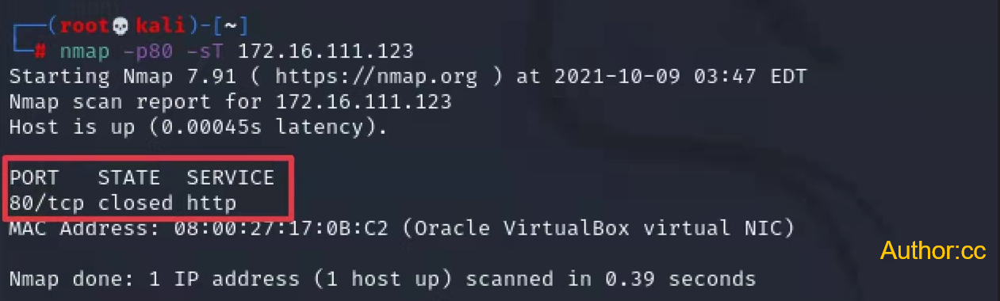
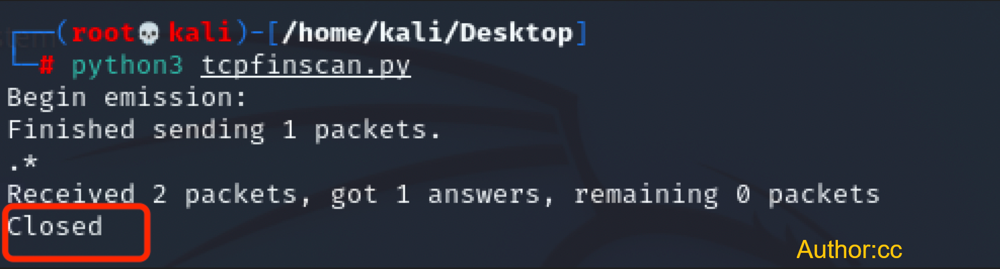

# 实验五：基于Scapy编写端口扫描器


## 实验目的

- 掌握网络扫描之端口状态的基本原理


## 实验环境

- python
- Scary
- nmap
- Linux kali


## 实验要求以及完成情况

- [x] 禁止探测互联网上的 IP ，严格遵守网络安全相关法律法规
- [X] 完成以下扫描技术的编程实现
  - [x] TCP connect scan / TCP stealth scan
  - [x] TCP Xmas scan / TCP fin scan / TCP null scan
  - [x] UDP scan
- [x] 上述每种扫描技术的实现测试均需要测试端口状态为：`开放`、`关闭` 和 `过滤` 状态时的程序执行结果
- [x] 提供每一次扫描测试的抓包结果并分析与课本中的扫描方法原理是否相符？如果不同，试分析原因
- [x] 在实验报告中详细说明实验网络环境拓扑、被测试 IP 的端口状态是如何模拟的
- [x] （可选）复刻 `nmap` 的上述扫描技术实现的命令行参数开关


## 实验过程

### 网络拓扑


以Attacker作为扫描端，Victim作为被扫描的靶机。

### **0.主机状态设置**

端口不是独立存在的，它是依附于进程的。当某个进程开启时，那么它对应的端口就开启，否则关闭。

- **开启状态**：对应端口开启监听：apache2基于TCP，在80端口提供服务；DNS服务基于UDP，在53端口提供服务。防火墙处于关闭状态。

```python
# 开启apache服务，以启用端口80
service apache2 start

#开启dnsmasq服务，以启用端口53
apt-get install dnsmasq
service dnsmasq start

# 查看开启状态
netstat -ntulp | grep 80
```


- **关闭状态**：对应端口没有开启监听, 防火墙没有开启。

```python
# 关闭apache服务，以关闭端口80
service apache2 stop

# 查看80端口对应的进程
lsof -i:80
```


- **过滤状态**：对应端口开启监听，防火墙开启。

```python
# 安装 ufw 防火墙
apt-get install ufw 

# 查看防火墙状态（默认 inactive）
ufw status

# 开启apache服务的同时开启防火墙，模拟filtered状态
ufw enable

# 关闭防火墙
ufw disable
```


### 1.TCP connect scan

**1.1 代码**

- [tcpconnectscan.py](py/tcpconnectscan.py)

- ```python
  nmap -sT -p80 ip
  ```

  

**1.2测试关闭端口**

- 扫描过程

  - scapy扫描

    

  - nmap扫描

    

- 数据包分析

  - scapy扫描

    

  - nmap扫描

    

**1.3测试开放端口**

- 扫描过程

  - scapy扫描

    

  - nmap扫描

    

- 数据包分析

  - scapy扫描

    

  - nmap扫描

    

**1.4 测试过滤端口**

- 扫描过程

  - Scapy扫描

    

  - Nmap扫描

    

- 数据包分析

  - scapy扫描

    

  - nmapy扫描

    

### 2.TCP stealth scan

**2.1 代码**

- [tcpstealthscan.py](py/tcpstealthscan.py)

- ```python
  nmap -sS -p80 ip
  ```

  

**2.2测试开放端口**

- 扫描过程

  - scapy扫描

    

  - nmap扫描

    

- 数据包分析

  - scapy扫描

    

  - nmap扫描

    

**2.3 测试关闭端口**

- 扫描过程

  - scapy扫描

    

  - nmap扫描

    

- 数据包分析

  - scapy扫描

    

  - nmap扫描

    

**2.4测试过滤端口**

- 扫描过程

  - scapy扫描

    

  - nmap扫描

    

- 数据包分析

  - scapy扫描

    

  - nmap扫描

    

### 3 TCP Xmas scan

**3.1 代码**

- [tcpxmasscan.py](py/tcpxmasscan.py)

- ```python
  nmap -p80 -sX ip
  ```

  

**3.2 测试开放端口**

- 扫描过程

  - scapy扫描

    

  - nmap扫描

    

- 数据包分析

  - scapy扫描

    

  - nmap扫描

    

**3.3 测试关闭端口**

- 扫描过程

  - scapy扫描

    

  - nmap扫描

    

- 数据包分析

  - scapy扫描

    

  - nmap扫描

    

**3.4 测试过滤端口**

- 扫描过程

  - scapy扫描

    

  - nmap扫描

    

- 数据包分析

  - scapy扫描

    

  - nmap扫描

    

### 4 TCP fin scan

**4.1 代码**

- [tcpfinscan.py](py/tcpfinscan.py)

- ```python
  nmap -sF -p80 172.16.111.123
  ```

**4.2 测试开放端口**

- 扫描过程

  - scapy扫描

    

  - nmap扫描

    

- 数据包分析

  - scapy扫描

    

  - nmap扫描

    

**4.3 测试关闭端口**

- 扫描过程

  - scapy扫描

    

  - nmap扫描

    

- 数据包分析

  - scapy扫描

    

  - nmap扫描

    

**4.4 测试过滤端口**

- 扫描过程

  - scapy扫描

    

  - nmap扫描

    

- 数据包分析

  - scapy扫描

    

  - nmap扫描

    

### 5 TCP null scan

**5.1 代码**

- [tcpnullscan.py](py/tcpnullscan.py)

- ```python
  nmap -sN ip
  ```

**5.2 测试开放端口**

- 扫描过程

  - scapy扫描

    

  - nmap扫描

    

- 数据包分析

  - scapy扫描

    

  - nmap扫描

    

**5.3 测试关闭端口**

- 扫描过程

  - scapy扫描

    

  - nmap扫描

    

- 数据包分析

  - scapy扫描

    

  - nmap扫描

    

**5.4 测试过滤端口**

- 扫描过程

  - scapy扫描

    

  - nmap扫描

    

- 数据包分析

  - scapy扫描

    

  - nmap扫描

    


### 6 UDP scan

**6.1 代码**

- [udpscan.py](py/udpscan.py)

- ```python
  nmap -sU -p53 ip
  ```


**6.2 测试开放端口**

- 扫描过程

  - scapy扫描

    

  - nmap扫描

    

- 数据包分析

  - scapy扫描

    

  - nmap扫描

    

**6.3 测试关闭端口**

- 扫描过程

  - scapy扫描

    

  - nmap扫描

    

- 数据包分析

  - scapy扫描

    

  - nmap扫描

    

**6.4 测试过滤端口**

- 扫描过程

  - scapy扫描

    

  - nmap扫描

    

- 数据包分析

  - scapy扫描

    

  - nmap扫描

    

### 其他问题

Q：提供每一次扫描测试的抓包结果并分析与课本中的扫描方法原理是否相符？如果不同，试分析原因；

A：抓包结果以截图形式展示在每次的扫描结果中；结果于原理相符，可参考[nmap官方文档](https://nmap.org/book/)。

## 参考资料

- [网络安全第五章在线课本](https://c4pr1c3.gitee.io/cuc-ns/)
- [scapy官方文档](https://scapy.readthedocs.io/en/latest/)
